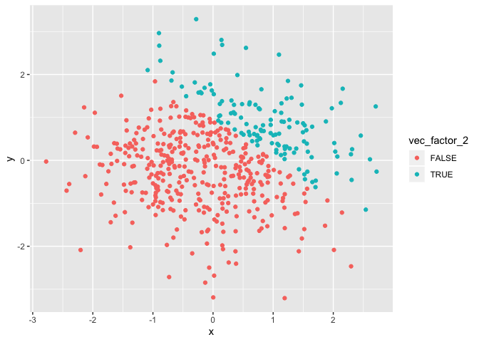

P8105\_homework1\_gl2677
================
Gaotong LIU (gl2677)
2019-09-20

# Problem 1

## Section 1

Here is a **code chunk** that creates the data frame comprised of:

  - A random sample of size 8 from a standard Normal distribution
  - A logical vector indicating whether elements of the sample are
    greater than 0
  - A character vector of length 8
  - A factor vector of length 8, with 3 different factor “levels”

<!-- end list -->

``` r
library(tidyverse)

sample = rnorm(8)
vec_numeric = sample
vec_logical = sample > 0
vec_char = c("My","name","is","Gaotong","LIU","MS","Biostatistic","T & M")
vec_factor = factor(c("High","Low","Medium","High","High","Low","Medium","Low"))
                    
df_1 = tibble(vec_numeric ,vec_logical ,vec_char ,vec_factor)
```

I try to take the mean of the variables:

The mean of `vec_numeric` is 0.7917769. The mean of `vec_logical` is
0.875. The mean of `vec_char` is NA. The mean of `vec_factor` is NA.

Therefore, only numeric and logical variables work for `mean()`

## Section 2

``` r
as.numeric(vec_logical)
as.numeric(vec_char)
as.numeric(vec_factor)

as.numeric(vec_logical) * sample
as.factor(vec_logical) * sample
as.numeric(as.factor(vec_logical)) * sample
```

`vec_logical` logical variables can be converted to numeric values, T =
1, F = 0. `vec_char` charcter variables can **not** be converted to
numberic variables, so there is no way to take the mean of character
variables. `vec_factor` factor variables can be converted to numeric
variables corresponding to levels, but these numeric variables can
**not** do basic computations.Therefore, factor variables do not work
for `mean()`

# Problem 2

## Section 1

Here is a **code chunk** that creates the data frame comprised of:

  - x: a random sample of size 500 from a standard Normal distribution
  - y: a random sample of size 500 from a standard Normal distribution
  - A logical vector indicating whether x + y \> 1
  - A numeric vector created by coercing the above logical vector
  - A factor vector created by coercing the above logical vector

<!-- end list -->

``` r
x = rnorm(500)
y = rnorm(500)
vec_logical_2 = x + y > 1
vec_numeric_2 = as.numeric(vec_logical_2)
vec_factor_2 = as.factor(vec_logical_2)
df_2 = tibble(x, y, vec_logical_2, vec_numeric_2, vec_factor_2)
```

The data frame has 500 rows and 5 columns. The mean of `x` is
-0.0085093, and the median of `x` is -0.014985, and the stardar
deviation of `x` is 0.9347692. The proportion of cases for which `x + y
> 1` is 0.248.

``` r
library(ggplot2)
df_2 %>% ggplot(aes(x = x, y = y, color = vec_logical_2)) +
  geom_point()
```

<!-- -->

``` r
ggsave("scatterplot_logical.pdf")
```

    ## Saving 7 x 5 in image

``` r
df_2 %>% ggplot(aes(x = x, y = y, color = vec_numeric_2)) +
  geom_point()
```

<!-- -->

``` r
df_2 %>% ggplot(aes(x = x, y = y, color = vec_factor_2)) +
  geom_point()
```

<!-- -->

The color scales of logical variables and factor variables are the same,
which contain only two categories. The color scale of numeric variables
is color plaette.
